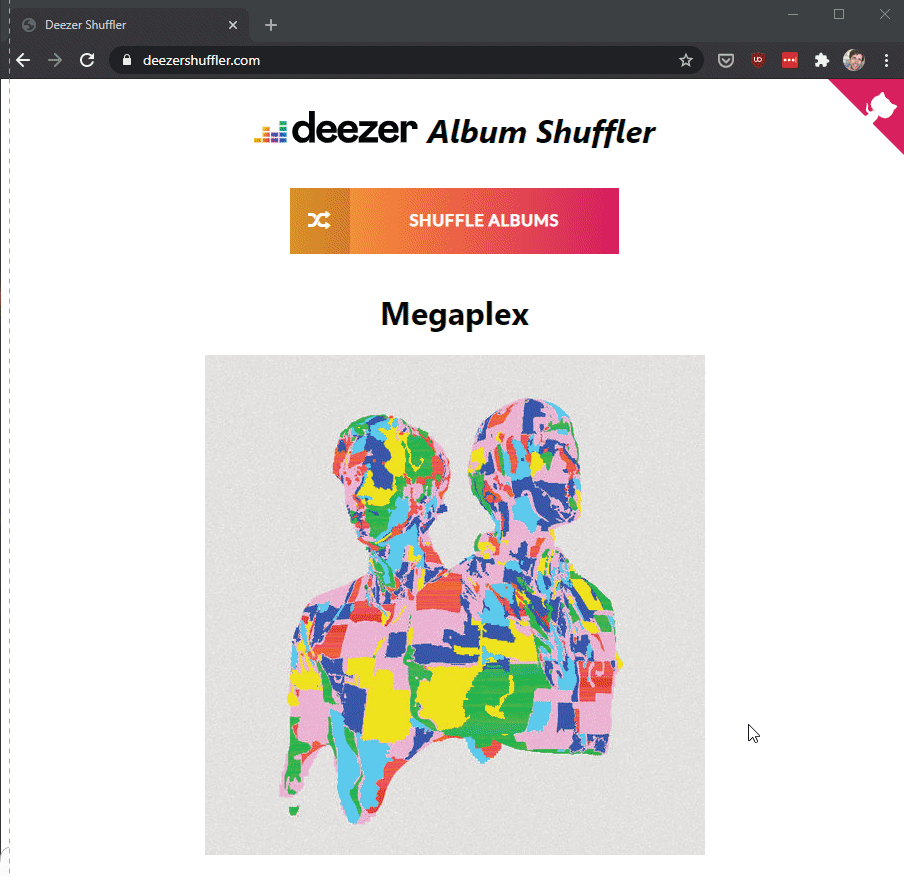

# DeezerShuffler 3
[DeezerShuffler.com](DeezerShuffler.com)

DeezerShuffler3 is a minimalist serverless web app that randomly selects an album from your Deezer favourites. Click on the album art to open the native Deezer app on the platform of your choice. Works with the Deezer apps on Windows, Mac OS, iOS, and Android. Requires basic read-only permmissions to your Deezer profile.

## Built With
- Python
- [Architect](https://arc.codes/)
- AWS

## How to deploy

### Production

1. Run `arc deploy production` within the `api` folder to deploy the back-end API. Your default AWS credentials will be used.
2. Merge front-end changes to the `prod` branch and AWS Amplify will automatically deploy the front-end.
